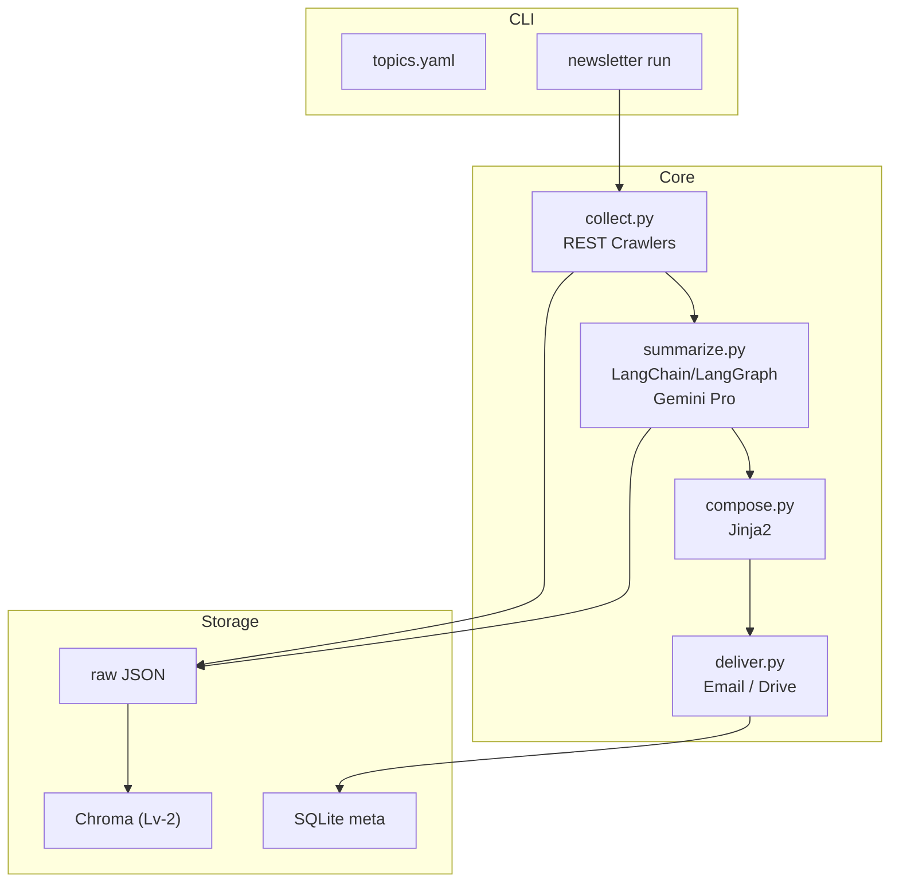

# Newsletter Generator 프로젝트 요구사항 문서 (PRD)

## 1. 개요

* **제품명**: Newsletter Generator
* **목적**: 내부 연구원이 입력(또는 자동 추천)한 키워드를 기반으로 최신 뉴스를 수집‧요약하여 이메일로 발송하고, 필요 시 Google Drive에 저장하는 Python CLI 도구를 제공한다.
* **최종 형태**: Python 패키지 + CLI 실행 파일(추후 Docker/FastAPI 서버 모드 지원)

---

## 2. 배경 및 기회

1. 연구원들은 기술 동향‧문헌 조사를 위해 수작업으로 뉴스를 모니터링함 → 시간 소모.
2. Make.com 등 노코드 시나리오는 대량 처리·버전 관리·보안 측면에서 한계.
3. Python CLI로 재구성하면 내부망에서도 손쉽게 배포(Pipx / PyInstaller) 가능.

---

## 3. 목표(Goals)

| ID | 목표                              | 성공 지표                                                                                             |
| -- | ------------------------------- | ------------------------------------------------------------------------------------------------- |
| G1 | **CLI 한 번으로 키워드 → 이메일 발송(MVP)** | `newsletter run --keywords "ADAS,LiDAR" --to alice@corp.com` 1회 실행 ⇢ 수신자 메일함에 HTML 뉴스레터 도착 ≤ 60 초 |
| G2 | Google Drive 저장(옵션)             | 동일 실행으로 Drive HTML 업로드 성공률 ≥ 95 %                                                                 |
| G3 | 키워드 자동 추천                       | `newsletter suggest` 명령 ⇢ 추천 키워드 ≥ 10개                                                            |
| G4 | 벡터 RAG 검색 통합                    | 과거 기사 인용 ≥ 1건 포함                                                                                  |

---

## 4. 범위(Scope)

### 4.1 포함

1. **CLI 도구(Typer)**
2. 기사 수집(NewsAPI or Serper.dev or GDELT)
3. **기사 필터링 (중복 제거, 주요 소스 우선, 도메인 다양성, 키워드 그룹화)**
4. **LLM 요약·편집 (LangChain, LangGraph, Google Gemini Pro)**
5. 이메일 발송(SendGrid API 또는 Outlook Graph)
6. Google Drive 파일 업로드(선택)
7. 키워드 자동 추천(Trends API + LLM)
8. 간단한 SQLite 메타DB(기사 URL 해시, 발송 로그)

### 4.2 제외

* 외부 상용 고객 배포(내부 연구원 전용)
* 모바일 전용 앱

---

## 5. 사용자(Persona)

| 페르소나          | 설명          | 핵심 가치                           |
| ------------- | ----------- | ------------------------------- |
| Researcher R1 | R\&D 센터 연구원 | 최신 기술 뉴스 자동 요약 메일 수신으로 리서치 효율 ↑ |

---

## 6. 기능 요구사항

### 6.1 MVP (Lv‑0)

| FR-ID | 기능                  | 상세 설명                                                                        |
| ----- | ------------------- | ---------------------------------------------------------------------------- |
| FR‑01 | 키워드 기반 기사 수집        | `newsletter collect --keywords "ADAS,LiDAR"` ⇢ 최근 24 시간 기사 ≤ 20건 JSON 반환. 수집된 기사는 중복 제거, 주요 소스 우선 처리, 도메인 다양성 확보, 키워드별 그룹화 등 필터링 과정을 거친다. |
| FR‑02 | 기사 요약               | LangChain/LangGraph 기반 Gemini Pro API 호출로 ①30자 제목 ②300자 요약 ③키워드 3개 JSON 생성 (필터링 및 그룹화된 기사 기반)                             |
| FR‑03 | 뉴스레터 Compose        | Jinja2 템플릿 또는 LLM 직접 생성을 통해 한국어 HTML 뉴스레터 합성 (필터링 및 그룹화된, 요약된 기사 기반)                                                |
| FR‑04 | **이메일 발송**          | `newsletter send --to alice@corp.com` 또는 `newsletter run` 통합 ⇢ HTML 본문 메일 발송 |
| FR‑05 | Google Drive 저장(옵션) | `/YYYY-MM-DD/newsletter.html` 업로드                                            |

### 6.2 확장 (Lv‑1)

| FR-ID | 기능         | 상세                                                   |
| ----- | ---------- | ---------------------------------------------------- |
| FR‑06 | 키워드 자동 추천  | `newsletter suggest --domain "자율주행"` ⇢ 트렌드 키워드 ≥ 10개 |
| FR‑07 | GUI 서버(선택) | `newsletter serve` ⇢ FastAPI Swagger 폼               |

### 6.3 고도화 (Lv‑2)

| FR-ID | 기능        | 상세                           |
| ----- | --------- | ---------------------------- |
| FR‑08 | 벡터 DB RAG | LangChain/LangGraph 활용, 과거 기사 벡터 검색(Chroma) 후 관련 링크 삽입 (RAG 파이프라인)       |
| FR‑09 | 개인화 뉴스레터  | `profiles.yaml`  관심 태그 기준 필터 |

---

## 7. 비기능 요구사항(NFR)

| ID     | 항목  | 목표                            |
| ------ | --- | ----------------------------- |
| NFR‑01 | 성능  | 20개 기사 처리 & 메일 발송 < 60 초      |
| NFR‑02 | 보안  | API 키 .env 관리, 내부 SMTP 연동 TLS |
| NFR‑03 | 테스트 | pytest 커버리지 ≥ 80 %            |

---

## 8. 시스템 아키텍처

---

## 9. 기술 스택 & 라이브러리

| 영역  | 라이브러리                                | 이유                    |
| --- | ------------------------------------ | --------------------- |
| CLI | Typer                                | click 기반, 자동 --help   |
| LLM | LangChain, LangGraph, google-generativeai (Gemini Pro) | LLM Orchestration, Agentic Workflows, 한국어 성능, 내부 연구 라이선스    |
| 크롤링 | NewsAPI, Serper.dev, GDELT           | 백업용 다중 소스             |
| 이메일 | SendGrid / Outlook Graph             | 대량 발송 & 내부 SMTP 대체 가능 |
| 포맷  | Jinja2 + Tailwind CDN                | 빠른 스타일링               |
| 배포  | PyPI + pipx / PyInstaller --onefile  | 내부 연구원 설치 편의          |

---

## 10. 마일스톤 & 일정(예시)

| Phase              | 기간       | 완료 기준                    |
| ------------------ | -------- | ------------------------ |
| M0 Kick‑off        | T0 + 0주  | PRD 승인                   |
| **M1 MVP(이메일 발송)** | T0 + 4주  | FR‑01 \~ FR‑05 통합 테스트 통과 |
| M2 Lv‑1 확장         | T0 + 8주  | 키워드 추천·GUI 데모            |
| M3 Lv‑2 RAG        | T0 + 12주 | 과거 기사 인용 발송 성공           |
| M4 내부 정식 배포        | T0 + 14주 | PyPI 사내 레포 버전 1.0 릴리스    |

---

## 11. 성공 지표(KPI)

1. 내부 연구원 주간 활성 사용자(WAU) ≥ 20명
2. 수작업 대비 뉴스 수집·편집 시간 80 % 절감
3. 사내 메일 오픈율 ≥ 50 %

---

## 12. 리스크 & 완화 전략

| 리스크          | 영향    | 완화                                 |
| ------------ | ----- | ---------------------------------- |
| 뉴스 API 쿼터 초과 | 수집 실패 | GDELT fallback, 캐시                 |
| LLM 비용 증가    | 운영비 ↑ | Gemini Pro 토큰 분석 → 요약 단계 chunk 최적화 |
| 사내 메일 스팸     | 발송 실패 | 내부 SMTP 허용 목록 등록                   |

---

## 13. 향후 발전 방향

* Notion DB 자동 싱크
* Slack 봇 알림
* PDF 뉴스레터 디자인 템플릿

---

## 14. LLM 시스템 프롬프트

**Role**: 당신은 뉴스들을 정리해서 친절하고 의미있게 설명해주는 편집자야. 한 주 간의 자율주행 기술 동향 주요 뉴스를 선별하고, "자율주행 기술 동향 뉴스 클리핑"을 제공하려고해.

**Context**: 당신의 독자들은 한국자동차연구원의 자율주행 시스템을 연구하는 주행제어기술부문의 CDC연구실에서 함께 뉴스들을 매주 확인하고 싶어하는 젊은 팀원들이야.

**Tone**: 한글로 정중한 존댓말로 써주기를 바래

**Objective**: 이 뉴스를 읽고, 함께 묶을 수 있는 이슈가 있으면 여러개로 묶어서 분류하고, 그안의 주요 내용들을 상세하게 설명해줘. 주요 카테고리별 주요언론사 뉴스링크를 남겨서 함께 제공해줘. 그래서 기사의 원문에 접근할 수 있도록 하되, 가독성을 위해서 참고링크를 하단에 만들어서 읽기 쉽게 만들어줘.

**Explain**: 각 카테고리 별로 관련분야 신입직원이 잘 모르는 어려운 용어나 개념이 나온다면 추가로 '이런 뜻이에요' 칸을 만들어서 간단하고 쉽게 설명해줘.

**End**: 마지막은 독자들을 위해 위 뉴스에서 도출할 수 있는 생각해볼 만한 거리나 명언들을 생각해서 인사말을 전해줘.

**Provider**: HTML 형식으로 바로 입력할 수 있도록 출력해줘. 관련 보유한 템플릿에 반영하도록

---

## 15. 문서 버전 기록

| 버전  | 일자         | 작성자     | 변경 요약                                           |
| --- | ---------- | ------- | ----------------------------------------------- |
| 0.4 | 2025-05-10 | GitHub Copilot | Refactor: Separate PRD and README content |
| 0.3 | 2025‑05‑09 | GitHub Copilot | LangChain/LangGraph 통합 반영, 관련 문서 업데이트 |
| 0.2 | 2025‑05‑09 | ChatGPT | MVP 범위 이메일 발송 반영, LLM → Gemini Pro, 대상 → 내부 연구원 |
| 0.1 | 2025‑05‑09 | ChatGPT | 초기 초안                                           |
