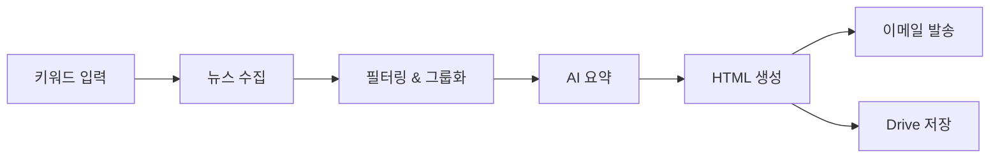

# Newsletter Generator

[](https://github.com/hjjung-katech/newsletter-generator/actions/workflows/ci.yml)
[](https://github.com/hjjung-katech/newsletter-generator/actions/workflows/code-quality.yml)
[](https://www.python.org/downloads/)
[](https://opensource.org/licenses/MIT)

**Newsletter Generator**는 키워드 기반으로 최신 뉴스를 수집·요약하여 HTML 뉴스레터를 생성하고 이메일로 발송하는 Python CLI 도구입니다.

## 🚀 주요 기능

- 🔍 **다양한 뉴스 소스**: Serper API, RSS 피드, 네이버 뉴스 API 통합
- 🤖 **멀티 LLM 지원**: Google Gemini, OpenAI GPT, Anthropic Claude 모델 통합 지원
- 🎛️ **기능별 LLM 설정**: 키워드 생성, 요약, HTML 생성 등 기능별로 다른 LLM 모델 사용 가능
- 📧 **자동 발송**: Postmark를 통한 이메일 발송 및 Google Drive 저장
- 🎯 **스마트 필터링**: 중복 제거, 주요 소스 우선순위, 키워드별 그룹화
- 📱 **두 가지 스타일**: Compact(간결) / Detailed(상세) 뉴스레터 지원
- 📧 **이메일 호환성**: 모든 이메일 클라이언트에서 완벽 렌더링되는 Email-Compatible 템플릿 지원
- 💰 **비용 추적**: 제공자별 토큰 사용량 및 비용 자동 추적

## 🚀 빠른 시작

### 설치

```bash
git clone https://github.com/username/newsletter-generator.git
cd newsletter-generator
pip install -e .
```

### 환경 설정

```bash
cp .env.example .env
# .env 파일을 편집하여 API 키 설정
```

필요한 API 키: 
- **필수**: Google Gemini API (기본 LLM), Serper API (뉴스 검색)
- **멀티 LLM**: Anthropic API (Claude 모델), OpenAI API (GPT 모델)
- **기타**: Postmark (이메일), Google Drive API (저장)

### 기본 사용법

```bash
# 키워드로 뉴스레터 생성
newsletter run --keywords "AI,머신러닝" --output-format html

# 도메인 기반 키워드 자동 생성
newsletter run --domain "자율주행" --to user@example.com

# 간결한 스타일로 생성
newsletter run --keywords "반도체" --template-style compact

# 이메일 호환 템플릿으로 생성 (모든 이메일 클라이언트에서 호환)
newsletter run --keywords "AI,머신러닝" --template-style detailed --email-compatible

# 이메일 호환 + 바로 전송
newsletter run --keywords "배터리,이차전지" --template-style compact --email-compatible --to user@example.com

# 이메일 발송 기능 테스트
newsletter test-email --to user@example.com --dry-run

# 기존 뉴스레터 파일로 이메일 테스트
newsletter test-email --to user@example.com --template output/newsletter.html

# 통합 이메일 테스트 (상세한 검증)
python tests/test_email_integration.py --to user@example.com

# LLM 제공자 정보 확인
newsletter list-providers
```

### 백그라운드 작업 실행

웹 서비스에서 예약 발송 등을 처리하려면 Redis‑RQ 워커를 별도로 실행해야 합니다.
워커는 기본 큐(`default`)를 사용하므로 웹 애플리케이션과 동일한 큐 이름으로
작업을 넣어야 합니다.

```bash
# 웹 서비스용 워커 실행
python web/worker.py
# 또는
rq worker --path ./web
```

## 🏗️ 아키텍처 개요

Newsletter Generator는 **통합 아키텍처**를 사용하여 Compact와 Detailed 두 가지 스타일의 뉴스레터를 하나의 코드베이스로 생성합니다.



## 🧪 테스트

### 자동 테스트 실행

```bash
# 전체 테스트 실행
pytest

# Email-Compatible 기능 테스트
pytest tests/test_email_compatibility.py -v

# 통합 테스트 (네트워크 연결 필요)
pytest tests/test_email_compatibility_integration.py -v

# 특정 기능 테스트
pytest tests/test_compose.py::test_email_compatible_rendering -v
```

### Email-Compatible 기능 테스트

```bash
# 이메일 호환성 테스트 보고서 생성
pytest tests/test_email_compatibility_integration.py::TestEmailCompatibilityReport::test_generate_compatibility_report -v

# 실제 이메일 전송 테스트 (환경변수 설정 필요)
export TEST_EMAIL_RECIPIENT="your-email@example.com"
pytest tests/test_email_compatibility_integration.py::TestEmailCompatibilityIntegration::test_email_sending_detailed -v

# 중복 파일 생성 방지 테스트
pytest tests/test_email_compatibility_integration.py::TestEmailCompatibilityIntegration::test_no_duplicate_files_generated -v
```

### 수동 테스트

```bash
# 4가지 조합 모두 테스트
newsletter run --keywords "AI,테스트" --template-style detailed              # 일반 Detailed
newsletter run --keywords "AI,테스트" --template-style compact               # 일반 Compact  
newsletter run --keywords "AI,테스트" --template-style detailed --email-compatible  # Email-Compatible Detailed
newsletter run --keywords "AI,테스트" --template-style compact --email-compatible   # Email-Compatible Compact

# 실제 이메일 전송 테스트
newsletter run --keywords "AI,테스트" --template-style detailed --email-compatible --to your-email@example.com
```

### 테스트 커버리지

현재 테스트 커버리지:
- ✅ **Email-Compatible 템플릿 렌더링**: HTML 구조, CSS 인라인, 호환성 검증
- ✅ **중복 파일 생성 방지**: 단일 파일 생성 확인
- ✅ **콘텐츠 무결성**: "이런 뜻이에요", "생각해 볼 거리" 섹션 포함 확인
- ✅ **크로스 플랫폼 호환성**: Gmail, Outlook, 모바일 클라이언트 호환성
- ✅ **실제 이메일 전송**: Postmark 통합 테스트

## 📚 문서

### 사용자 문서
- **[📖 사용자 가이드](docs/user/USER_GUIDE.md)** - 상세한 사용법 및 워크플로우
- **[⚡ CLI 참조](docs/user/CLI_REFERENCE.md)** - 모든 명령어 및 옵션
- **[🔧 설치 가이드](docs/setup/INSTALLATION.md)** - 상세한 설치 및 설정 방법

### 기술 문서
- **[🤖 LLM 설정 가이드](docs/technical/LLM_CONFIGURATION.md)** - 다양한 LLM 제공자 설정 및 최적화
- **[👨‍💻 개발자 가이드](docs/dev/DEVELOPMENT_GUIDE.md)** - 개발 환경 설정 및 기여 방법
- **[🏗️ 시스템 아키텍처](docs/ARCHITECTURE.md)** - 전체 시스템 구조 및 설계
- **[📋 프로젝트 요구사항](docs/PRD.md)** - 프로젝트 목표 및 요구사항

### 프로젝트 정보
- **[📄 변경사항](docs/CHANGELOG.md)** - 버전별 업데이트 내역
- **[📁 전체 문서 목록](docs/README.md)** - 모든 문서의 체계적 안내

## 🤝 기여하기

1. [개발자 가이드](docs/dev/DEVELOPMENT_GUIDE.md)를 읽어보세요
2. 이슈를 생성하거나 기존 이슈를 확인하세요
3. Fork 후 feature branch를 생성하세요
4. 변경사항을 커밋하고 Pull Request를 생성하세요

## 📄 라이선스

이 프로젝트는 MIT 라이선스 하에 배포됩니다. 자세한 내용은 [LICENSE](LICENSE) 파일을 참조하세요.

## 🆘 지원

- **[이슈 트래커](https://github.com/hjjung-katech/newsletter-generator/issues)** - 버그 리포트 및 기능 요청
- **[토론](https://github.com/hjjung-katech/newsletter-generator/discussions)** - 질문 및 아이디어 공유
- **[문서](docs/README.md)** - 상세한 사용법 및 개발 가이드

## 🚨 문제 해결

### API 할당량 초과 문제

Google Gemini API의 일일 할당량을 초과한 경우 다음과 같이 해결할 수 있습니다:

#### 1. 현재 LLM 상태 확인
```bash
newsletter check-llm
```

#### 2. 다른 LLM 제공자 사용
OpenAI 또는 Anthropic API 키를 `.env` 파일에 추가:

```bash
# .env 파일에 추가
OPENAI_API_KEY=your_openai_api_key_here
# 또는
ANTHROPIC_API_KEY=your_anthropic_api_key_here
```

#### 3. LLM 설정 변경
`config.yml` 파일에서 기본 제공자를 변경:

```yaml
llm_settings:
  default_provider: "openai"  # 또는 "anthropic"
```

#### 4. LLM 테스트
```bash
newsletter test-llm --task keyword_generation --prompt "자율주행 관련 키워드 5개 생성"
```

### 새로운 다중 LLM 기능

이제 여러 LLM 제공자를 동시에 사용할 수 있습니다:

- **Gemini**: 한국어 지원 우수, 빠른 응답
- **OpenAI GPT-4**: 안정적이고 정확한 응답
- **Anthropic Claude**: 자연스러운 글쓰기, 구조화된 작업에 강함

#### 자동 Fallback 기능
- API 할당량 초과 시 자동으로 다른 제공자로 전환
- 429 에러 감지 및 자동 복구
- 사용자 개입 없이 안정적인 서비스 제공

#### 작업별 최적화
각 작업에 가장 적합한 LLM이 자동으로 선택됩니다:
- 키워드 생성: 창의성이 중요한 작업
- 뉴스 요약: 정확성이 중요한 작업  
- HTML 생성: 구조화된 작업
