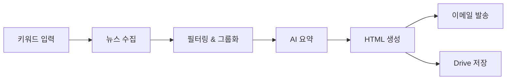

# Newsletter Generator

[](https://github.com/your-org/newsletter-generator/actions/workflows/ci.yml)
[](https://github.com/your-org/newsletter-generator/actions/workflows/code-quality.yml)
[](https://www.python.org/downloads/)
[](https://opensource.org/licenses/MIT)

**Newsletter Generator**는 키워드 기반으로 최신 뉴스를 수집·요약하여 HTML 뉴스레터를 생성하고 이메일로 발송하는 Python CLI 도구입니다.

## ✨ 주요 기능

- 🔍 **다양한 뉴스 소스**: Serper API, RSS 피드, 네이버 뉴스 API 통합
- 🤖 **AI 기반 요약**: Google Gemini Pro를 활용한 지능형 뉴스 요약
- 📧 **자동 발송**: Postmark를 통한 이메일 발송 및 Google Drive 저장
- 🎯 **스마트 필터링**: 중복 제거, 주요 소스 우선순위, 키워드별 그룹화
- 📱 **두 가지 스타일**: Compact(간결) / Detailed(상세) 뉴스레터 지원

## 🚀 빠른 시작

### 설치

```bash
git clone https://github.com/username/newsletter-generator.git
cd newsletter-generator
pip install -e .
```

### 환경 설정

```bash
cp .env.example .env
# .env 파일을 편집하여 API 키 설정
```

필요한 API 키: Google Gemini Pro, Serper API, Postmark, Google Drive API

### 기본 사용법

```bash
# 키워드로 뉴스레터 생성
newsletter run --keywords "AI,머신러닝" --output-format html

# 도메인 기반 키워드 자동 생성
newsletter run --domain "자율주행" --to user@example.com

# 간결한 스타일로 생성
newsletter run --keywords "반도체" --template-style compact

# 이메일 발송 기능 테스트
newsletter test-email --to user@example.com --dry-run

# 기존 뉴스레터 파일로 이메일 테스트
newsletter test-email --to user@example.com --template output/newsletter.html

# 통합 이메일 테스트 (상세한 검증)
python tests/test_email_integration.py --to user@example.com
```

## 🏗️ 아키텍처 개요

Newsletter Generator는 **통합 아키텍처**를 사용하여 Compact와 Detailed 두 가지 스타일의 뉴스레터를 하나의 코드베이스로 생성합니다.



## 📚 문서

### 사용자 문서
- **[📖 사용자 가이드](docs/user/USER_GUIDE.md)** - 상세한 사용법 및 워크플로우
- **[⚡ CLI 참조](docs/user/CLI_REFERENCE.md)** - 모든 명령어 및 옵션
- **[🔧 설치 가이드](docs/setup/INSTALLATION.md)** - 상세한 설치 및 설정 방법

### 개발자 문서
- **[👨‍💻 개발자 가이드](docs/dev/DEVELOPMENT_GUIDE.md)** - 개발 환경 설정 및 기여 방법
- **[🏗️ 시스템 아키텍처](docs/ARCHITECTURE.md)** - 전체 시스템 구조 및 설계
- **[📋 프로젝트 요구사항](docs/PRD.md)** - 프로젝트 목표 및 요구사항

### 프로젝트 정보
- **[📄 변경사항](docs/CHANGELOG.md)** - 버전별 업데이트 내역
- **[📁 전체 문서 목록](docs/README.md)** - 모든 문서의 체계적 안내

## 🤝 기여하기

1. [개발자 가이드](docs/dev/DEVELOPMENT_GUIDE.md)를 읽어보세요
2. 이슈를 생성하거나 기존 이슈를 확인하세요
3. Fork 후 feature branch를 생성하세요
4. 변경사항을 커밋하고 Pull Request를 생성하세요

## 📄 라이선스

이 프로젝트는 MIT 라이선스 하에 배포됩니다. 자세한 내용은 [LICENSE](LICENSE) 파일을 참조하세요.

## 🆘 지원

- **[이슈 트래커](https://github.com/your-org/newsletter-generator/issues)** - 버그 리포트 및 기능 요청
- **[토론](https://github.com/your-org/newsletter-generator/discussions)** - 질문 및 아이디어 공유
- **[문서](docs/README.md)** - 상세한 사용법 및 개발 가이드
