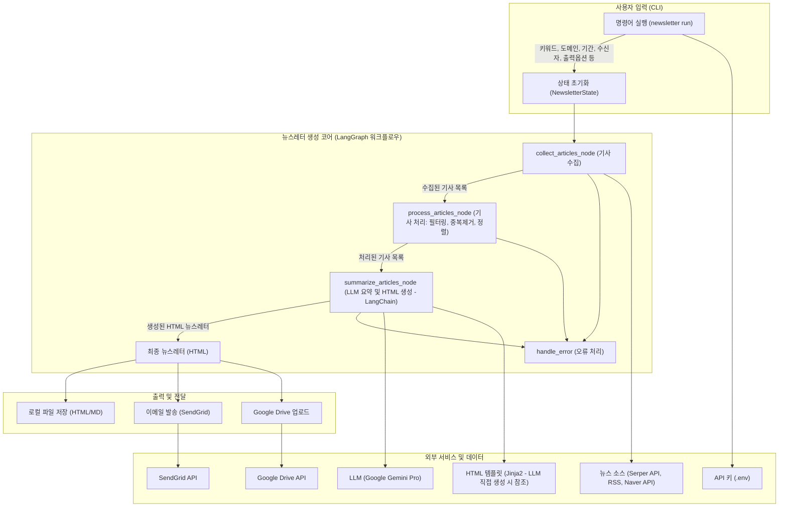

# 뉴스레터 생성기 아키텍처

## 개요

본 문서는 뉴스레터 생성기의 기능, 아키텍처 구조, 그리고 핵심 작성 방식에 대해 설명합니다. 뉴스레터 생성기는 사용자가 제공한 키워드 또는 관심 도메인을 기반으로 다양한 소스에서 최신 뉴스를 수집하고, 이를 LLM(Large Language Model)을 활용하여 요약 및 편집하여 HTML 형식의 뉴스레터를 생성하고 이메일 발송 또는 Google Drive에 저장하는 기능을 제공하는 Python CLI 도구입니다.

## 1. 기능 및 아키텍처

### 1.1. 입력 (CLI)

사용자는 CLI를 통해 뉴스레터 생성을 요청하며, 다음과 같은 주요 옵션을 사용할 수 있습니다:

*   `--keywords`: 뉴스 검색을 위한 키워드 (쉼표로 구분)
*   `--domain`: 키워드 생성을 위한 관심 분야 (키워드 미지정 시)
*   `--suggest-count`: `--domain` 사용 시 생성할 키워드 개수 (기본값: 10)
*   `--period` (`-p`): 최신 뉴스 수집 기간(일 단위, 기본값: 14일)
*   `--to`: 뉴스레터를 발송할 이메일 주소
*   `--output-format`: 로컬 저장 시 파일 형식 (`html`, `md`, 기본값: `html`)
*   `--drive`: Google Drive에 뉴스레터 저장 여부
*   필터링 옵션: 중복 제거 (`--no-filter-duplicates`), 주요 소스 우선 처리 (`--no-major-sources-filter`) 등

### 1.2. 핵심 처리 (Core Engine - LangGraph 기반 워크플로우)

뉴스레터 생성의 핵심 로직은 LangGraph를 사용하여 정의된 워크플로우를 통해 수행됩니다.

*   **상태 관리 (`NewsletterState`):**
    *   뉴스레터 생성 전 과정의 상태를 TypedDict 형태로 관리합니다.
    *   포함 정보: 입력 키워드, 뉴스 수집 기간, 수집된 기사 목록, 처리된 기사 목록, 기사 요약 결과, 최종 뉴스레터 HTML, 오류 정보, 현재 진행 상태 (예: 'collecting', 'processing', 'summarizing', 'complete', 'error')

*   **워크플로우 그래프 (`newsletter.graph.create_newsletter_graph`):**
    *   **`collect_articles_node` (기사 수집):**
        *   입력된 키워드 또는 도메인 기반으로 자동 생성된 키워드를 사용하여 다양한 뉴스 소스에서 기사를 수집합니다.
        *   **지원 소스:**
            *   Serper.dev API (Google 검색 결과를 활용)
            *   RSS 피드 (예: 연합뉴스TV, 한겨레, 동아일보, 경향신문 등)
            *   Naver Search API (설정 시 사용 가능)
        *   수집된 원본 기사 데이터는 디버깅 및 추적을 위해 JSON 파일로 저장될 수 있습니다. (예: `output/intermediate_processing/{timestamp}_collected_articles_raw.json`)
    *   **`process_articles_node` (기사 처리):**
        *   **날짜 필터링:** `news_period_days` 설정에 따라 지정된 기간 내의 최신 기사만 선택합니다.
        *   **중복 제거:** 기사 URL 및 제목의 유사도를 기반으로 중복된 기사를 식별하고 제거합니다.
        *   **정렬:** 처리된 기사를 날짜 기준으로 최신순으로 정렬합니다.
        *   처리 및 필터링된 기사 목록 또한 JSON 파일로 저장될 수 있습니다. (예: `output/intermediate_processing/{timestamp}_collected_articles_processed.json`)
    *   **`summarize_articles_node` (기사 요약 및 뉴스레터 생성):**
        *   처리된 기사 목록을 입력으로 받아 LLM(Google Gemini Pro)을 사용하여 뉴스레터 콘텐츠를 생성합니다.
        *   **LangChain (`newsletter.chains`) 활용:**
            *   **시스템 프롬프트 (`SYSTEM_PROMPT`):** LLM의 역할, 목표, 생성할 콘텐츠의 구조, 스타일, 언어 등을 상세하게 정의하여 일관되고 고품질의 결과물을 유도합니다.
                *   **역할:** "주간 산업 동향 뉴스 클리핑"을 작성하는 전문 편집자.
                *   **목표:** 입력된 기사들을 분석하고 요약하여 HTML 형식의 뉴스레터를 생성.
                *   **출력 형식:** 기사의 수와 주제의 복잡성에 따라 "기본 형식" 또는 "카테고리별 정리 형식" 중 더 적합한 HTML 구조를 선택하여 생성.
                *   **세부 요구사항:**
                    *   **카테고리 분류:** 입력된 뉴스 기사들을 내용에 따라 여러 카테고리로 분류 (예: "전기차 시장 동향", "하이브리드차 동향").
                    *   **카테고리별 요약:** 각 카테고리별로 해당 기사들의 주요 내용을 종합하여 상세하게 설명하는 요약문 작성.
                    *   **용어 설명:** 각 카테고리 요약문에서 신입직원이 이해하기 어려울 수 있는 전문 용어나 개념을 선정하여 "💡 이런 뜻이에요!" 섹션에 쉽고 간단하게 설명.
                    *   **HTML 직접 생성:** 최종 결과물은 다른 설명 없이 순수한 HTML 코드여야 함.
                    *   **언어 및 톤:** 한국어, 정중한 존댓말 사용.
            *   LLM은 이 프롬프트와 제공된 기사 데이터를 기반으로 최종 뉴스레터 HTML을 생성합니다.
    *   **`handle_error` (오류 처리):**
        *   워크플로우의 각 노드 실행 중 발생하는 예외나 오류를 감지하고, `NewsletterState`의 `error` 필드에 관련 정보를 기록하며 `status`를 'error'로 변경합니다.

*   **워크플로우 실행 (`newsletter.graph.generate_newsletter`):**
    *   초기 상태(`NewsletterState`)를 설정하고, 정의된 LangGraph 워크플로우를 실행(`graph.invoke(initial_state)`)합니다.
    *   최종 상태에서 뉴스레터 HTML과 성공/실패 상태를 반환합니다.

### 1.3. 출력 및 전달 (Delivery)

생성된 뉴스레터는 사용자의 설정에 따라 다음과 같은 방식으로 전달됩니다.

*   **로컬 파일 저장 (`newsletter.deliver.save_locally`):**
    *   생성된 뉴스레터(HTML 또는 Markdown 형식)를 로컬 파일 시스템에 저장합니다.
    *   파일명 규칙: `{현재날짜}_newsletter_{키워드목록}.{확장자}` (예: `2025-05-13_newsletter_AI_반도체.html`)
*   **이메일 발송 (`newsletter.cli`에서 직접 처리, 과거 `newsletter.deliver.send_email`):**
    *   SendGrid API를 사용하여 지정된 수신자(`--to` 옵션)에게 HTML 뉴스레터를 이메일로 발송합니다.
    *   `.env` 파일에 `SENDGRID_API_KEY` 설정이 필요합니다.
*   **Google Drive 업로드 (`newsletter.deliver.save_to_drive`):**
    *   Google Drive API를 사용하여 뉴스레터를 HTML 및 Markdown 형식으로 사용자의 Google Drive에 업로드합니다.
    *   Google Cloud Platform 프로젝트 설정 및 인증 정보 (`credentials.json` 또는 환경 변수)가 필요합니다.

### 1.4. 주요 기술 스택 및 라이브러리

| 영역                | 기술/라이브러리                                       | 주요 역할                                   |
| ------------------- | ----------------------------------------------------- | ------------------------------------------- |
| **CLI**             | `Typer`                                               | 사용자 친화적 명령줄 인터페이스 제공        |
| **LLM Orchestration** | `LangChain`, `LangGraph`                              | LLM 기반 워크플로우 구성 및 실행, 상태 관리 |
| **LLM**             | Google `Gemini Pro` (`google-generativeai`)           | 뉴스 기사 요약 및 뉴스레터 콘텐츠 생성      |
| **뉴스 수집**       | `requests`, `feedparser`, Serper.dev API, Naver API | 다양한 웹 소스에서 뉴스 데이터 크롤링/수집  |
| **HTML 템플릿**     | `Jinja2`                                              | 동적 HTML 뉴스레터 생성 (LLM 직접 생성 방식과 병행) |
| **API 키 관리**     | `python-dotenv` (`.env` 파일)                         | 민감한 API 키 및 설정 정보 관리             |
| **Google API**      | `google-api-python-client`, `google-auth`             | Google Drive 연동                           |
| **이메일 발송**     | `sendgrid` (과거)                                     | SendGrid API를 통한 이메일 발송             |

### 1.5. 아키텍처 다이어그램 (Mermaid)

## 2. 뉴스레터 작성 방식 (LLM 프롬프트 중심)

뉴스레터의 내용과 형식은 주로 LLM(Google Gemini Pro)에 전달되는 프롬프트를 통해 제어됩니다. `newsletter.chains.SYSTEM_PROMPT`에 정의된 내용을 기반으로 다음과 같은 방식으로 작성됩니다.

*   **명확한 역할 부여:**
    *   LLM에게 "주간 산업 동향 뉴스 클리핑을 작성하는 전문 편집자"라는 구체적인 역할을 부여하여, 결과물의 톤앤매너와 전문성을 확보합니다.

*   **구체적인 목표 및 지시사항:**
    *   **뉴스레터 주제:** "주간 산업 동향 뉴스 클리핑"으로 명시합니다.
    *   **대상 독자:** 특정 분야의 "신입직원"도 이해할 수 있도록 쉬운 설명을 포함하도록 유도합니다.
    *   **핵심 작업:**
        1.  **카테고리 분류:** 제공된 뉴스 기사들을 내용에 따라 관련된 여러 카테고리로 논리적으로 분류합니다. (예: "AI 반도체 시장", "자율주행 기술 발전")
        2.  **카테고리별 상세 요약:** 각 분류된 카테고리에 해당하는 기사들의 핵심 내용을 종합하여, 해당 주제에 대한 상세하고 이해하기 쉬운 요약문을 작성합니다.
        3.  **전문 용어 해설:** 각 카테고리 요약문 내에서 독자가 이해하기 어려울 수 있는 전문 용어나 최신 기술 트렌드 관련 개념이 있다면, 이를 선정하여 "💡 이런 뜻이에요!"라는 별도 섹션에 간결하고 명확하게 설명하는 목록을 추가합니다.
    *   **추가 고려사항:** 뉴스레터 말미에는 독자들에게 해당 주의 뉴스 내용과 관련하여 생각해볼 만한 질문을 던지거나, 영감을 줄 수 있는 명언 등을 포함하여 긍정적인 마무리를 하도록 합니다.

*   **출력 형식 및 언어 지정:**
    *   **HTML 직접 생성:** 최종 결과물은 별도의 가공 없이 바로 사용할 수 있는 순수한 HTML 코드여야 함을 명시합니다.
    *   **템플릿 선택:** 제공된 기사의 수량, 내용의 다양성 및 복잡성 등을 고려하여, 미리 정의된 두 가지 HTML 형식("기본 형식" 또는 "카테고리별 정리 형식") 중 가장 적절한 것을 LLM이 스스로 판단하여 선택하고 그 형식에 맞춰 전체 뉴스레터 HTML을 생성하도록 지시합니다.
    *   **언어:** 모든 내용은 한국어 정중체(존댓말)로 작성하도록 합니다.

*   **입력 데이터 형식 안내:**
    *   LLM에게 전달될 사용자 메시지에는 뉴스레터 생성 대상 키워드와 함께, 처리된 뉴스 기사 목록(각 기사는 제목, URL, 원문 내용 또는 사전 요약된 내용으로 구성)이 제공됨을 명시합니다.

이러한 상세한 프롬프트 설계를 통해, LLM은 일관된 품질과 구조를 가진 맞춤형 뉴스레터를 효과적으로 생성할 수 있습니다.
