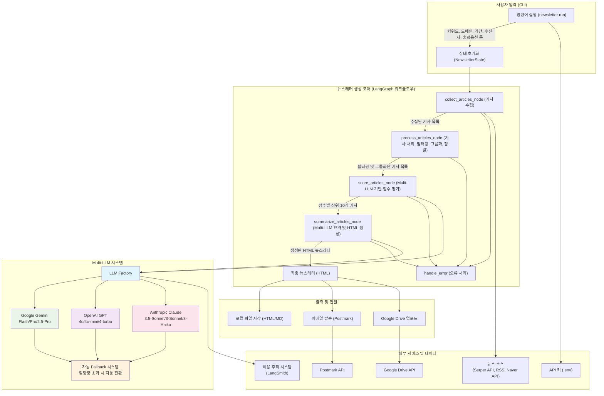
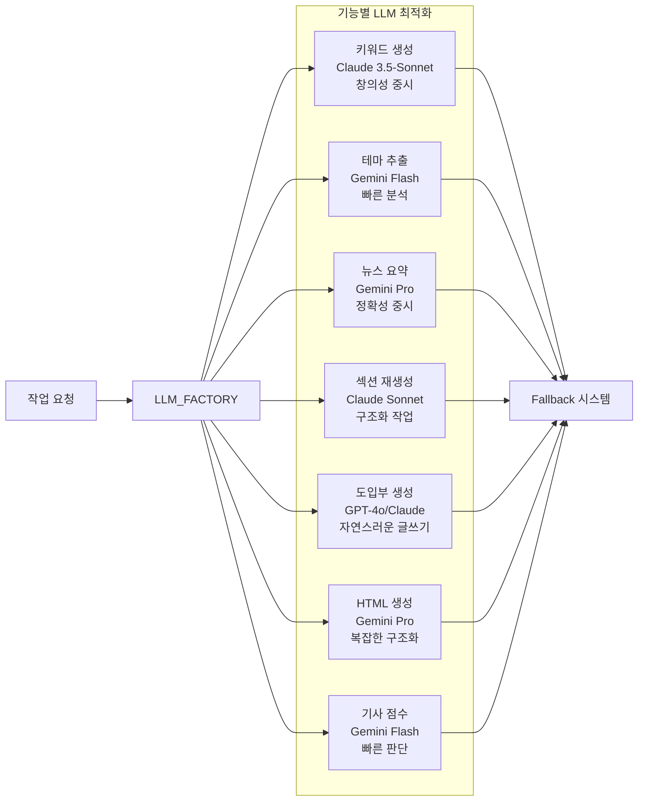

# 뉴스레터 생성기 아키텍처

## 개요

본 문서는 뉴스레터 생성기의 기능, 아키텍처 구조, 그리고 핵심 작성 방식을 설명합니다. 뉴스레터 생성기는 사용자가 제공한 키워드 또는 관심 도메인을 기반으로 다양한 소스에서 최신 뉴스를 수집하고, 이를 **멀티 LLM(Large Language Model) 시스템**으로 요약/편집하여 HTML 뉴스레터를 생성, 검토, 발송, 보관하는 도구입니다. 현재 운영 표면은 Flask web runtime이 중심이며, CLI와 scheduler/automation은 이를 보조합니다.

## 문서 역할

- 이 문서는 현재 시스템 구조의 정본(SSOT)입니다.
- 구조 경계와 CI 강제 규칙은 `docs/technical/adr-0001-architecture-boundaries.md` 를 따릅니다.
- 변경 이력과 단계별 이관 기록은 `docs/technical/architecture-migration-log.md` 에 남깁니다.
- shim 제거 계획은 `docs/technical/shim-deprecation-schedule.md` 에서 관리합니다.

## 0. Multi-LLM 시스템 아키텍처

### 0.1. 지원되는 LLM 제공자

Newsletter Generator는 여러 LLM 제공자를 통합 지원하며, 기능별로 최적화된 모델을 자동 선택합니다:

#### Google Gemini
- **모델**: `gemini-2.5-pro`, `gemini-1.5-pro`, `gemini-2.5-flash`
- **강점**: 무료 할당량 제공, 긴 컨텍스트 지원, 한국어 지원 우수
- **주요 용도**: 뉴스 요약, HTML 생성, 기사 점수 평가

#### OpenAI GPT
- **모델**: `gpt-4o`, `gpt-4o-mini`, `gpt-4-turbo`
- **강점**: 뛰어난 텍스트 생성 품질, 빠른 응답
- **주요 용도**: 키워드 생성, 도입부 생성

#### Anthropic Claude
- **모델**: `claude-3-5-sonnet`, `claude-3-sonnet`, `claude-3-haiku`
- **강점**: 안전성, 정확한 분석, 구조화된 작업
- **주요 용도**: 키워드 생성, 섹션 재생성, 도입부 생성

### 0.2. LLM Factory 패턴

```python
# LLM Factory 구조
class LLMFactory:
    providers = {
        "gemini": GeminiProvider(),
        "openai": OpenAIProvider(),
        "anthropic": AnthropicProvider()
    }

    def get_llm_for_task(task: str) -> LLM:
        # 기능별 최적화된 LLM 반환
        # 자동 fallback 지원
```

- 현재 provider/model 선택, 설정 정규화, provider info shaping 같은 순수 결정 로직은 `newsletter_core/application/llm_factory.py` 로 이관되었고, fallback runtime 설정 정규화, fallback chain 구성, retry/error helper 같은 orchestration helper는 `newsletter_core/application/llm_factory_fallback.py` 로 이동했습니다.
- provider SDK 생성, env/API key 접근, provider 초기화 입력 조립 같은 runtime adapter 책임은 `newsletter_core/infrastructure/llm_factory_runtime.py` 로 이동했습니다.
- `newsletter/llm_factory.py` 는 fallback/singleton entrypoint와 legacy import path 호환을 담당하는 thin compatibility boundary로 유지됩니다.
- `newsletter/tools.py` 는 여전히 legacy integration surface이지만, Serper 입력 정규화/결과 shaping과 theme/filename 순수 helper는 `newsletter_core/application/tools_support.py` 로, request plan/response orchestration/aggregation helper는 `newsletter_core/application/tools_search_flow.py` 로, raw Serper request execution/status normalization은 `newsletter_core/infrastructure/tools_search_runtime.py` 로 이동했고 HTML/file/LLM/app-context glue만 legacy wrapper에 남깁니다.
- `newsletter/graph.py` 는 여전히 legacy runtime shell이지만, state 초기화, branch routing, summary result normalization, final result shaping은 `newsletter_core/application/graph_workflow.py` 로, collect/process/score/summarize/compose node 내부의 transformation/state-update helper는 `newsletter_core/application/graph_node_helpers.py` 로, summarize invocation plan/result handoff와 compose/theme resolution 같은 invocation-adjacent composition helper는 `newsletter_core/application/graph_composition.py` 로 이동했고 node IO/file/runtime glue와 LangGraph wiring만 legacy 경계에 남깁니다.
- `web/routes_generation.py` 는 여전히 Flask wiring, request/app context, DB/task side-effect 경계를 담당하는 legacy route shell이지만, request parsing/validation, preview/schedule option normalization, sync response shaping은 `web/generation_route_support.py` 로, dispatch planning과 schedule/status response composition은 `web/generation_route_dispatch.py` 로, pre-dispatch/task payload assembly와 pre-persistence/pre-side-effect shaping은 `web/generation_route_actions.py` 로 이동해 endpoint 의미와 HTTP semantics는 유지한 채 hotspot 책임을 줄입니다.
- schedule / execution history 운영 가시성은 route shell이 직접 문자열을 조립하지 않고 `web/generation_route_support.py`, `web/generation_route_dispatch.py`, `web/static/js/app_view_state_helpers.js` 가 additive `execution_visibility` / `latest_execution` render model을 공통으로 정규화해 API payload와 web surface가 같은 상태를 설명하도록 유지합니다.
- approval workflow 운영 가시성도 같은 경계를 따르며, `web/routes_approval.py` 와 `web/generation_route_support.py` 가 additive `approval_visibility` / `execution_visibility` payload를 만들고 `web/static/js/app_view_state_helpers.js` 가 pending, approved, rejected, unavailable 상태의 label, message, timestamp, action availability를 공통 render model로 정규화해 approval inbox와 history surface가 같은 상태를 설명하도록 유지합니다.
- `web/static/js/app.js` 는 여전히 DOM wiring, event binding, fetch/storage, actual DOM mutation을 담당하는 browser shell이지만, request payload builder, response normalization, generation result/detail render helper는 `web/static/js/app_request_response_helpers.js` 로, history/approvals/analytics/source-policies/schedules 쪽의 derived UI state, section render orchestration, empty/error-state helper는 `web/static/js/app_view_state_helpers.js` 로, archive/preset/tab/schedule selection/visibility와 archive hydration snapshot helper는 `web/static/js/app_selection_visibility_helpers.js` 로 이동해 UI/API semantics를 유지한 채 hotspot 책임을 줄입니다.

### 0.3. 자동 Fallback 시스템

API 할당량 초과나 오류 발생 시 자동으로 다른 제공자로 전환:

1. **1차 Fallback**: 같은 제공자 내 안정적인 모델로 전환
2. **2차 Fallback**: 다른 제공자의 호환 모델로 전환
3. **오류 처리**: 모든 fallback 실패 시 적절한 에러 메시지 제공

### 0.4. 기능별 LLM 최적화

| 기능 | 추천 LLM | 이유 | 설정 |
|------|----------|------|------|
| **키워드 생성** | Anthropic Claude | 창의성과 다양성 | temperature: 0.7 |
| **테마 추출** | Gemini Flash | 빠른 분석과 분류 | temperature: 0.2 |
| **뉴스 요약** | Gemini Pro | 정확성과 한국어 지원 | temperature: 0.3 |
| **섹션 재생성** | Claude Sonnet | 구조화된 작업 | temperature: 0.3 |
| **도입부 생성** | Claude/GPT-4o | 자연스러운 글쓰기 | temperature: 0.4 |
| **HTML 생성** | Gemini Pro | 복잡한 구조화 작업 | temperature: 0.2 |
| **기사 점수** | Gemini Flash | 빠른 판단 | temperature: 0.1 |

### 0.5. 비용 최적화 전략

```yaml
# 비용 효율적인 모델 선택
keyword_generation: gpt-4o-mini  # $0.15/1M tokens
theme_extraction: gemini-flash   # 무료 할당량
news_summarization: gemini-pro   # $0.70/1M tokens
html_generation: gemini-pro      # 복잡한 작업에만 고성능 모델
```

## 1. 기능 및 아키텍처

### 1.1. 입력 (CLI)

사용자는 CLI를 통해 뉴스레터 생성을 요청하며, 다음과 같은 주요 옵션을 사용할 수 있습니다:

*   `--keywords`: 뉴스 검색을 위한 키워드 (쉼표로 구분)
*   `--domain`: 키워드 생성을 위한 관심 분야 (키워드 미지정 시)
*   `--suggest-count`: `--domain` 사용 시 생성할 키워드 개수 (기본값: 10)
*   `--period` (`-p`): 최신 뉴스 수집 기간(일 단위, 기본값: 14일)
*   `--to`: 뉴스레터를 발송할 이메일 주소
*   `--output-format`: 로컬 저장 시 파일 형식 (`html`, `md`, 기본값: `html`)
*   `--drive`: Google Drive에 뉴스레터 저장 여부
*   필터링 옵션:
    *   `--max-per-source INT`: 도메인별 최대 기사 수를 지정합니다.
    *   `--no-filter-duplicates`: 중복 기사 필터링을 비활성화합니다.
    *   `--no-major-sources-filter`: 주요 뉴스 소스 우선순위 지정을 비활성화합니다.
    *   `--no-group-by-keywords`: 키워드별 기사 그룹화를 비활성화합니다.

### 1.2. 핵심 처리 (Core Engine - LangGraph 기반 워크플로우)

뉴스레터 생성의 핵심 로직은 LangGraph를 사용하여 정의된 워크플로우를 통해 수행됩니다.

*   **상태 관리 (`NewsletterState`):**
    *   뉴스레터 생성 전 과정의 상태를 TypedDict 형태로 관리합니다.
    *   포함 정보: 입력 키워드, 뉴스 수집 기간, 수집된 원본 기사 목록, **필터링 및 그룹화된 기사 목록**, **점수가 매겨진 상위 기사 목록 (`ranked_articles`)**, 기사 요약 결과, 최종 뉴스레터 HTML, 오류 정보, 현재 진행 상태 (예: 'collecting', 'processing', 'scoring', 'summarizing', 'composing', 'complete', 'error')

*   **워크플로우 그래프 (`newsletter.graph.create_newsletter_graph`):**
    *   **`collect_articles_node` (기사 수집):**
        *   입력된 키워드 또는 도메인 기반으로 자동 생성된 키워드를 사용하여 다양한 뉴스 소스에서 기사를 수집합니다.
        *   **지원 소스:**
            *   Serper.dev API (Google 검색 결과를 활용)
            *   RSS 피드 (예: 연합뉴스TV, 한겨레, 동아일보, 경향신문 등)
            *   Naver Search API (설정 시 사용 가능)
        *   수집된 원본 기사 데이터는 디버깅 및 추적을 위해 JSON 파일로 저장될 수 있습니다. (예: `output/intermediate_processing/{timestamp}_collected_articles_raw.json`)
    *   **`process_articles_node` (기사 처리 및 필터링):**
        *   **날짜 필터링:** `news_period_days` 설정에 따라 지정된 기간 내의 최신 기사만 선택합니다.
        *   **중복 제거:** 기사 URL 및 제목의 유사도를 기반으로 중복된 기사를 식별하고 제거합니다.
        *   **주요 뉴스 소스 우선순위 지정:** 신뢰할 수 있는 주요 뉴스 소스의 기사를 우선적으로 포함하도록 정렬하거나 가중치를 부여합니다.
        *   **도메인 다양성 보장:** 특정 출처의 기사가 과도하게 포함되지 않도록 도메인별 기사 수를 제한합니다. (`--max-per-source` 옵션)
        *   **키워드별 기사 그룹화:** 관련된 키워드를 가진 기사들을 그룹화하여 뉴스레터의 가독성과 주제별 집중도를 높입니다.
        *   **정렬:** 처리된 기사를 날짜 기준으로 최신순으로 정렬합니다. (필터링 및 그룹화 이후 최종 정렬)
        *   처리, 필터링 및 그룹화된 기사 목록 또한 JSON 파일로 저장될 수 있습니다. (예: `output/intermediate_processing/{timestamp}_collected_articles_processed_filtered_grouped.json`)
    *   **`score_articles_node` (기사 점수 평가 및 우선순위 결정):**
        *   **LLM 기반 다차원 평가:** Google Gemini Pro를 사용하여 각 기사를 다음 기준으로 1-5점 척도로 평가합니다:
            *   **관련성(Relevance):** 뉴스레터 주제/도메인과의 연관성 (가중치: 40%)
            *   **영향력(Impact):** 산업이나 사회에 미치는 영향의 크기 (가중치: 25%)
            *   **참신성(Novelty):** 새로운 정보나 트렌드의 포함 정도 (가중치: 15%)
        *   **소스 신뢰도 평가:** 뉴스 소스의 티어에 따른 가중치 부여 (가중치: 10%)
            *   Tier 1 (주요 언론사): 1.0 가중치
            *   Tier 2 (보조 언론사): 0.8 가중치
            *   기타 소스: 0.6 가중치
        *   **시간적 신선도:** 기사 발행일을 기준으로 한 시간 가중치 (가중치: 10%)
            *   지수 감쇠 함수 사용: `exp(-days/14)` (14일 반감기)
        *   **종합 우선순위 점수 계산:** 위 5개 요소의 가중 평균으로 0-100점 척도의 최종 점수 산출
        *   **상위 기사 선별:** 점수 기준 내림차순 정렬 후 상위 10개 기사를 다음 단계로 전달
        *   점수가 매겨진 전체 기사 목록은 JSON 파일로 저장됩니다. (예: `output/intermediate_processing/{timestamp}_scored_articles.json`)
    *   **`summarize_articles_node` (기사 요약 및 뉴스레터 생성):**
        *   필터링 및 그룹화된 기사 목록을 입력으로 받아 LLM(Google Gemini Pro)을 사용하여 뉴스레터 콘텐츠를 생성합니다.
        *   **LangChain (`newsletter.chains`) 활용:**
            *   **시스템 프롬프트 (`SYSTEM_PROMPT`):** LLM의 역할, 목표, 생성할 콘텐츠의 구조, 스타일, 언어 등을 상세하게 정의하여 일관되고 고품질의 결과물을 유도합니다.
                *   **역할:** "주간 산업 동향 뉴스 클리핑"을 작성하는 전문 편집자.
                *   **목표:** 입력된 기사들을 분석하고 요약하여 HTML 형식의 뉴스레터를 생성.
                *   **출력 형식:** 기사의 수와 주제의 복잡성에 따라 "기본 형식" 또는 "카테고리별 정리 형식" 중 더 적합한 HTML 구조를 선택하여 생성.
                *   **세부 요구사항:**
                    *   **카테고리 분류:** 입력된 뉴스 기사들을 내용에 따라 여러 카테고리로 분류 (예: "전기차 시장 동향", "하이브리드차 동향").
                    *   **카테고리별 요약:** 각 카테고리별로 해당 기사들의 주요 내용을 종합하여 상세하게 설명하는 요약문 작성.
                    *   **용어 설명:** 각 카테고리 요약문에서 신입직원이 이해하기 어려울 수 있는 전문 용어나 개념을 선정하여 "💡 이런 뜻이에요!" 섹션에 쉽고 간단하게 설명.
                    *   **HTML 직접 생성:** 최종 결과물은 다른 설명 없이 순수한 HTML 코드여야 함.
                    *   **언어 및 톤:** 한국어, 정중한 존댓말 사용.
            *   LLM은 이 프롬프트와 제공된 기사 데이터를 기반으로 최종 뉴스레터 HTML을 생성합니다.
    *   **`handle_error` (오류 처리):**
        *   워크플로우의 각 노드 실행 중 발생하는 예외나 오류를 감지하고, `NewsletterState`의 `error` 필드에 관련 정보를 기록하며 `status`를 'error'로 변경합니다.

*   **워크플로우 실행 (`newsletter.graph.generate_newsletter`):**
    *   초기 상태(`NewsletterState`)를 설정하고, 정의된 LangGraph 워크플로우를 실행(`graph.invoke(initial_state)`)합니다.
    *   최종 상태에서 뉴스레터 HTML과 성공/실패 상태를 반환합니다.

### 1.2.1. 통합 Compose 계층

- 현재 뉴스레터 조합 단계는 `compose_newsletter()` 중심의 공용 경로를 사용합니다.
- 스타일별 차이는 별도 구현 복제가 아니라 설정과 템플릿 선택으로 처리합니다.
- 공용 조합 단계는 다음 책임을 공유합니다.
    * 상위 기사 추출
    * 주제별 그룹화
    * 용어 정의/부가 콘텐츠 추출
    * 최종 템플릿 렌더링
- `newsletter.graph` 와 `newsletter.chains` 는 이 공용 조합 경로를 호출하고, 레거시 wrapper는 호환성 유지를 위해 얇게 남아 있습니다.
- 현재 지원 스타일과 API 계약은 `docs/reference/web-api.md` 와 `docs/user/CLI_REFERENCE.md` 를 우선 기준으로 봅니다.

### 1.3. 출력 및 전달 (Delivery)

생성된 뉴스레터는 사용자의 설정에 따라 다음과 같은 방식으로 전달됩니다.

*   **로컬 파일 저장 (`newsletter.deliver.save_locally`):**
    *   생성된 뉴스레터(HTML 또는 Markdown 형식)를 로컬 파일 시스템에 저장합니다.
    *   파일명 규칙: `{현재날짜}_newsletter_{키워드목록}.{확장자}` (예: `2025-05-13_newsletter_AI_반도체.html`)
*   **이메일 발송 (`newsletter.cli`에서 직접 처리, 과거 `newsletter.deliver.send_email`):**
*   Postmark API를 사용하여 지정된 수신자(`--to` 옵션)에게 HTML 뉴스레터를 이메일로 발송합니다.
*   `.env` 파일에 `POSTMARK_SERVER_TOKEN` 설정이 필요합니다.
*   **Google Drive 업로드 (`newsletter.deliver.save_to_drive`):**
    *   Google Drive API를 사용하여 뉴스레터를 HTML 및 Markdown 형식으로 사용자의 Google Drive에 업로드합니다.
    *   Google Cloud Platform 프로젝트 설정 및 인증 정보 (`credentials.json` 또는 환경 변수)가 필요합니다.

### 1.4. 주요 기술 스택 및 라이브러리

| 영역                | 기술/라이브러리                                       | 주요 역할                                   |
| ------------------- | ----------------------------------------------------- | ------------------------------------------- |
| **CLI**             | `Typer`                                               | 사용자 친화적 명령줄 인터페이스 제공        |
| **LLM Orchestration** | `LangChain`, `LangGraph`                              | LLM 기반 워크플로우 구성 및 실행, 상태 관리 |
| **Multi-LLM 시스템** | **Custom LLM Factory + Provider Pattern**            | **여러 LLM 제공자 통합 관리 및 자동 Fallback** |
| **LLM - Google**    | `langchain-google-genai` (Gemini Pro/Flash/2.5-Pro)  | **한국어 뉴스 요약, HTML 생성, 기사 점수 평가** |
| **LLM - OpenAI**    | `langchain-openai` (GPT-4o/4o-mini/4-turbo)          | **키워드 생성, 도입부 생성, 고품질 텍스트 생성** |
| **LLM - Anthropic** | `langchain-anthropic` (Claude 3.5-Sonnet/3-Sonnet/3-Haiku) | **창의적 키워드 생성, 구조화된 섹션 재생성** |
| **뉴스 수집**       | `requests`, `feedparser`, Serper.dev API, Naver API | 다양한 웹 소스에서 뉴스 데이터 크롤링/수집  |
| **비용 추적**       | **Custom Cost Tracking + LangSmith**                 | **제공자별 토큰 사용량 및 비용 모니터링**   |
| **HTML 템플릿**     | `Jinja2`                                              | 동적 HTML 뉴스레터 생성 (LLM 직접 생성 방식과 병행) |
| **API 키 관리**     | `python-dotenv` (`.env` 파일)                         | 민감한 API 키 및 설정 정보 관리             |
| **Google API**      | `google-api-python-client`, `google-auth`             | Google Drive 연동                           |
| **이메일 발송**     | `postmark`                                            | Postmark API를 통한 이메일 발송             |

#### Multi-LLM 시스템 핵심 구성 요소

| 컴포넌트 | 기능 | 특징 |
|----------|------|------|
| **LLM Factory** | 제공자별 LLM 인스턴스 생성 | Factory Pattern, Singleton 지원 |
| **Provider Pattern** | 제공자별 통합 인터페이스 | Gemini/OpenAI/Anthropic 추상화 |
| **LLMWithFallback** | 자동 오류 복구 래퍼 | 429/529 에러 감지 및 자동 전환 |
| **Cost Callback** | 실시간 비용 추적 | 제공자별 토큰 사용량 및 비용 계산 |
| **Task Optimizer** | 기능별 최적 모델 선택 | Temperature, timeout 등 세밀 조정 |

### 1.5. 아키텍처 다이어그램 (Mermaid)



#### Multi-LLM 워크플로우 세부사항



## 2. 뉴스레터 작성 방식 (LLM 프롬프트 중심)

뉴스레터의 내용과 형식은 주로 LLM(Google Gemini Pro)에 전달되는 프롬프트를 통해 제어됩니다. `newsletter.chains.SYSTEM_PROMPT`에 정의된 내용을 기반으로 다음과 같은 방식으로 작성됩니다.

*   **명확한 역할 부여:**
    *   LLM에게 "주간 산업 동향 뉴스 클리핑을 작성하는 전문 편집자"라는 구체적인 역할을 부여하여, 결과물의 톤앤매너와 전문성을 확보합니다.

*   **구체적인 목표 및 지시사항:**
    *   **뉴스레터 주제:** "주간 산업 동향 뉴스 클리핑"으로 명시합니다.
    *   **대상 독자:** 특정 분야의 "신입직원"도 이해할 수 있도록 쉬운 설명을 포함하도록 유도합니다.
    *   **핵심 작업:**
        1.  **카테고리 분류:** 제공된 뉴스 기사들을 내용에 따라 관련된 여러 카테고리로 논리적으로 분류합니다. (예: "AI 반도체 시장", "자율주행 기술 발전")
        2.  **카테고리별 상세 요약:** 각 분류된 카테고리에 해당하는 기사들의 핵심 내용을 종합하여, 해당 주제에 대한 상세하고 이해하기 쉬운 요약문을 작성합니다.
        3.  **전문 용어 해설:** 각 카테고리 요약문 내에서 독자가 이해하기 어려울 수 있는 전문 용어나 최신 기술 트렌드 관련 개념이 있다면, 이를 선정하여 "💡 이런 뜻이에요!"라는 별도 섹션에 간결하고 명확하게 설명하는 목록을 추가합니다.
    *   **추가 고려사항:** 뉴스레터 말미에는 독자들에게 해당 주의 뉴스 내용과 관련하여 생각해볼 만한 질문을 던지거나, 영감을 줄 수 있는 명언 등을 포함하여 긍정적인 마무리를 하도록 합니다.

*   **출력 형식 및 언어 지정:**
    *   **HTML 직접 생성:** 최종 결과물은 별도의 가공 없이 바로 사용할 수 있는 순수한 HTML 코드여야 함을 명시합니다.
    *   **템플릿 선택:** 제공된 기사의 수량, 내용의 다양성 및 복잡성 등을 고려하여, 미리 정의된 두 가지 HTML 형식("기본 형식" 또는 "카테고리별 정리 형식") 중 가장 적절한 것을 LLM이 스스로 판단하여 선택하고 그 형식에 맞춰 전체 뉴스레터 HTML을 생성하도록 지시합니다.
    *   **언어:** 모든 내용은 한국어 정중체(존댓말)로 작성하도록 합니다.

*   **입력 데이터 형식 안내:**
    *   LLM에게 전달될 사용자 메시지에는 뉴스레터 생성 대상 키워드와 함께, 필터링 및 그룹화된 뉴스 기사 목록(각 기사는 제목, URL, 원문 내용 또는 사전 요약된 내용, 그룹 정보 등으로 구성)이 제공됨을 명시합니다.

이러한 상세한 프롬프트 설계를 통해, LLM은 일관된 품질과 구조를 가진 맞춤형 뉴스레터를 효과적으로 생성할 수 있습니다.
