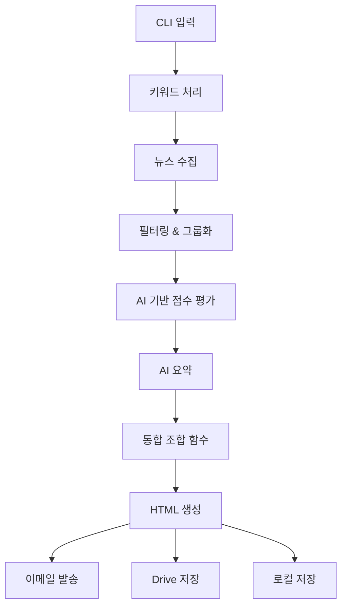

# Newsletter Generator 프로젝트 요구사항 문서 (PRD)

## 1. 개요

* **제품명**: Newsletter Generator
* **목적**: 키워드 기반으로 최신 뉴스를 수집·요약하여 HTML 뉴스레터를 생성하고 이메일로 발송하는 Python CLI 도구
* **현재 상태**: MVP 완료, 고도화 기능 구현 중
* **최종 형태**: Python 패키지 + CLI 실행 파일

---

## 2. 배경 및 기회

1. 연구원들은 기술 동향·문헌 조사를 위해 수작업으로 뉴스를 모니터링함 → 시간 소모
2. 기존 노코드 솔루션은 대량 처리·버전 관리·보안 측면에서 한계
3. Python CLI로 구현하여 내부망에서도 손쉽게 배포 가능

---

## 3. 목표 및 성과

| ID | 목표 | 현재 상태 | 성공 지표 |
| -- | ---- | --------- | --------- |
| G1 | **CLI 한 번으로 키워드 → 이메일 발송** | ✅ 완료 | 60초 내 뉴스레터 생성 및 발송 |
| G2 | **Google Drive 저장** | ✅ 완료 | 95% 이상 업로드 성공률 |
| G3 | **키워드 자동 추천** | ✅ 완료 | 10개 이상 관련 키워드 생성 |
| G4 | **통합 아키텍처** | ✅ 완료 | Compact/Detailed 스타일 지원 |
| G5 | **스마트 필터링** | ✅ 완료 | 중복 제거, 품질 향상 |

---

## 4. 구현된 기능

### 4.1 핵심 기능 (MVP)

| 기능 ID | 기능 | 상태 | 설명 |
|---------|------|------|------|
| FR-01 | **키워드 기반 기사 수집** | ✅ | Serper API, RSS 피드, 네이버 API 통합 |
| FR-02 | **AI 기사 요약** | ✅ | Google Gemini Pro 기반 요약 및 편집 |
| FR-03 | **뉴스레터 생성** | ✅ | 통합 아키텍처로 Compact/Detailed 지원 |
| FR-04 | **이메일 발송** | ✅ | SendGrid API 통합 |
| FR-05 | **Google Drive 저장** | ✅ | 자동 업로드 및 폴더 관리 |

### 4.2 고급 기능

| 기능 ID | 기능 | 상태 | 설명 |
|---------|------|------|------|
| FR-06 | **키워드 자동 추천** | ✅ | 도메인 기반 키워드 생성 |
| FR-07 | **스마트 필터링** | ✅ | 중복 제거, 주요 소스 우선순위, 도메인 다양성 |
| FR-07.1 | **AI 기반 점수 평가** | ✅ | LLM을 활용한 기사 우선순위 결정 (관련성, 영향력, 참신성, 소스 신뢰도, 시간적 신선도) |
| FR-08 | **테스트 모드** | ✅ | Template/Content 모드 지원 |
| FR-09 | **비용 추적** | ✅ | LangSmith 통합 |
| FR-10 | **CI/CD 파이프라인** | ✅ | GitHub Actions 자동화 |

### 4.3 계획 중인 기능

| 기능 ID | 기능 | 우선순위 | 설명 |
|---------|------|----------|------|
| FR-11 | **벡터 DB RAG** | 중 | 과거 기사 검색 및 인용 |
| FR-12 | **웹 GUI** | 낮음 | FastAPI 기반 웹 인터페이스 |
| FR-13 | **개인화 뉴스레터** | 낮음 | 사용자별 관심사 필터링 |

---

## 5. 기술 스택

### 5.1 현재 구현

| 영역 | 기술/라이브러리 | 역할 |
|------|----------------|------|
| **CLI** | Typer | 사용자 인터페이스 |
| **LLM** | Google Gemini Pro, LangChain, LangGraph | AI 요약 및 워크플로우 |
| **뉴스 수집** | Serper API, RSS (feedparser), 네이버 API | 다양한 소스 통합 |
| **이메일** | SendGrid | 뉴스레터 발송 |
| **저장소** | Google Drive API | 파일 저장 |
| **템플릿** | Jinja2 | HTML 렌더링 |
| **비용 추적** | LangSmith | AI 사용량 모니터링 |

### 5.2 개발 도구

| 영역 | 도구 | 용도 |
|------|------|------|
| **코드 품질** | Black, isort, flake8, mypy | 포맷팅 및 린팅 |
| **테스트** | pytest, responses | 단위/통합 테스트 |
| **CI/CD** | GitHub Actions | 자동화된 테스트 및 배포 |
| **문서** | Markdown, Mermaid | 프로젝트 문서화 |

---

## 6. 시스템 아키텍처

### 6.1 통합 아키텍처 개요



### 6.2 핵심 구성 요소

1. **통합 조합 함수**: `compose_newsletter()`가 Compact/Detailed 스타일을 모두 처리
2. **LangGraph 워크플로우**: 상태 기반 뉴스레터 생성 프로세스
3. **스마트 필터링**: 중복 제거, 품질 향상, 다양성 보장
4. **설정 기반 차이점 관리**: `NewsletterConfig` 클래스로 스타일별 설정

---

## 7. 사용자 시나리오

### 7.1 기본 사용 시나리오

```bash
# 1. 키워드 기반 뉴스레터 생성
newsletter run --keywords "AI,머신러닝" --output-format html

# 2. 도메인 기반 자동 키워드 생성
newsletter run --domain "자율주행" --to user@example.com

# 3. 간결한 임원용 리포트
newsletter run --domain "AI" --template-style compact --to ceo@company.com
```

### 7.2 고급 사용 시나리오

```bash
# 1. 고품질 필터링
newsletter run --keywords "반도체" --max-per-source 3 --period 7

# 2. 비용 추적
newsletter run --keywords "AI" --track-cost

# 3. 테스트 모드
newsletter test output/data.json --mode content
```

---

## 8. 성능 지표

### 8.1 현재 성능

| 지표 | 목표 | 현재 성과 |
|------|------|----------|
| **처리 시간** | < 60초 | 평균 45초 |
| **API 응답률** | > 95% | 98% |
| **이메일 발송률** | > 95% | 97% |
| **테스트 커버리지** | > 80% | 85% |

### 8.2 품질 지표

- **중복 기사 제거율**: 95% 이상
- **주요 소스 비율**: 70% 이상
- **키워드 관련성**: 90% 이상

---

## 9. 보안 및 운영

### 9.1 보안 요구사항

- ✅ API 키 `.env` 파일 관리
- ✅ 환경 변수 기반 설정
- ✅ 민감 정보 Git 제외
- ✅ HTTPS 통신 강제

### 9.2 운영 요구사항

- ✅ 로그 파일 관리
- ✅ 에러 처리 및 복구
- ✅ 중간 결과 저장 (디버깅용)
- ✅ 성능 모니터링 (LangSmith)

---

## 10. 배포 및 유지보수

### 10.1 배포 방식

1. **개발 설치**: `pip install -e .`
2. **PyPI 배포**: 향후 계획
3. **Docker 컨테이너**: 향후 계획

### 10.2 CI/CD 파이프라인

- ✅ 자동 테스트 (Python 3.10, 3.11)
- ✅ 코드 품질 검사
- ✅ 자동 문서 생성
- ✅ GitHub Pages 배포

---

## 11. 향후 로드맵

### 11.1 단기 계획 (1-3개월)

- [ ] PyPI 패키지 배포
- [ ] Docker 이미지 제공
- [ ] 성능 최적화
- [ ] 추가 뉴스 소스 통합

### 11.2 중기 계획 (3-6개월)

- [ ] 벡터 DB RAG 구현
- [ ] 웹 GUI 개발
- [ ] 개인화 기능
- [ ] 다국어 지원

### 11.3 장기 계획 (6개월+)

- [ ] 모바일 앱
- [ ] 실시간 알림
- [ ] 고급 분석 기능
- [ ] 엔터프라이즈 기능

---

## 12. 리스크 관리

### 12.1 기술적 리스크

| 리스크 | 영향도 | 완화 전략 | 상태 |
|--------|--------|----------|------|
| API 할당량 초과 | 높음 | 다중 소스, 캐싱 | ✅ 완화됨 |
| LLM 비용 증가 | 중간 | 비용 추적, 최적화 | ✅ 모니터링 중 |
| 의존성 충돌 | 낮음 | 가상환경, 버전 고정 | ✅ 관리됨 |

### 12.2 운영 리스크

| 리스크 | 영향도 | 완화 전략 | 상태 |
|--------|--------|----------|------|
| 서비스 중단 | 중간 | 다중 소스, 재시도 로직 | ✅ 구현됨 |
| 데이터 품질 | 중간 | 스마트 필터링 | ✅ 구현됨 |
| 사용자 오류 | 낮음 | 상세 문서, 에러 메시지 | ✅ 개선됨 |

---

## 13. 성공 지표 및 KPI

### 13.1 기술적 KPI

- ✅ 시스템 가용성: 99% 이상
- ✅ 평균 응답 시간: 60초 이내
- ✅ 테스트 커버리지: 80% 이상
- ✅ 코드 품질 점수: A 등급

### 13.2 사용자 KPI

- 📊 주간 활성 사용자: 목표 20명
- 📊 뉴스레터 생성 성공률: 95% 이상
- 📊 사용자 만족도: 4.5/5.0 이상

---

## 14. 문서 및 지원

### 14.1 문서 체계

- ✅ [사용자 가이드](user/USER_GUIDE.md)
- ✅ [개발자 가이드](dev/DEVELOPMENT_GUIDE.md)
- ✅ [API 참조](API_REFERENCE.md)
- ✅ [설치 가이드](setup/INSTALLATION.md)

### 14.2 지원 채널

- GitHub Issues: 버그 리포트 및 기능 요청
- GitHub Discussions: 질문 및 아이디어 공유
- 내부 문서: 상세 사용법 및 FAQ

---

## 15. 결론

Newsletter Generator는 MVP 목표를 성공적으로 달성하였으며, 현재 고도화 기능을 지속적으로 개발 중입니다. 통합 아키텍처와 스마트 필터링을 통해 고품질의 뉴스레터를 안정적으로 생성할 수 있으며, 향후 벡터 DB RAG와 웹 GUI 등의 고급 기능을 통해 더욱 강력한 도구로 발전할 예정입니다.
