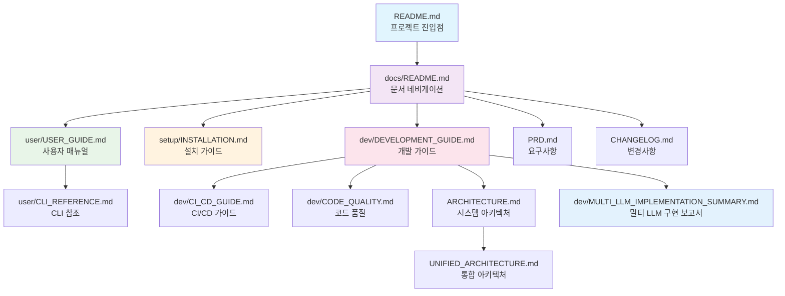

# Newsletter Generator Documentation

이 디렉토리는 Newsletter Generator 프로젝트의 모든 문서를 포함합니다. 각 문서는 특정 사용자 그룹과 목적에 맞게 구성되어 있습니다.

## 📋 문서 개요

### 🎯 사용자별 문서 분류

| 사용자 유형 | 주요 문서 | 설명 |
|------------|----------|------|
| **최종 사용자** | [USER_GUIDE.md](user/USER_GUIDE.md), [CLI_REFERENCE.md](user/CLI_REFERENCE.md) | 뉴스레터 생성 및 사용법 |
| **시스템 관리자** | [INSTALLATION.md](setup/INSTALLATION.md) | 설치, 설정, 배포 |
| **개발자** | [DEVELOPMENT_GUIDE.md](dev/DEVELOPMENT_GUIDE.md), [ARCHITECTURE.md](ARCHITECTURE.md) | 개발 환경, 코드 기여 |
| **프로젝트 관리자** | [PRD.md](PRD.md), [CHANGELOG.md](CHANGELOG.md) | 요구사항, 변경사항 추적 |

## 📁 문서 구조

### 📖 사용자 문서 (`user/`)
최종 사용자를 위한 실용적인 가이드

- **[USER_GUIDE.md](user/USER_GUIDE.md)** - 📖 종합 사용자 매뉴얼
  - 워크플로우 다이어그램
  - 사용 패턴 및 모범 사례
  - 문제 해결 가이드
- **[CLI_REFERENCE.md](user/CLI_REFERENCE.md)** - ⚡ CLI 명령어 완전 참조
  - 모든 명령어 및 옵션
  - 실용적인 예시
  - 환경 변수 설정
- **[MULTI_LLM_GUIDE.md](user/MULTI_LLM_GUIDE.md)** - 🤖 Multi-LLM 설정 가이드
  - 지원되는 LLM 제공자 (Gemini, OpenAI, Anthropic)
  - 기능별 LLM 모델 설정
  - 비용 최적화 전략
  - 자동 fallback 시스템

### 🔧 설정 문서 (`setup/`)
시스템 설치 및 구성 가이드

- **[INSTALLATION.md](setup/INSTALLATION.md)** - 🔧 상세 설치 가이드
  - 시스템 요구사항
  - 단계별 설치 과정
  - API 키 설정
  - 문제 해결

### 👨‍💻 개발자 문서 (`dev/`)
개발 환경 및 기여 가이드

- **[DEVELOPMENT_GUIDE.md](dev/DEVELOPMENT_GUIDE.md)** - 👨‍💻 종합 개발 가이드
  - 개발 환경 설정
  - 프로젝트 구조 이해
  - 코딩 표준 및 가이드라인
  - 테스트 작성 및 실행
  - 디버깅 방법
  - 기여 프로세스
  - 릴리스 절차
- **[MULTI_LLM_IMPLEMENTATION_SUMMARY.md](dev/MULTI_LLM_IMPLEMENTATION_SUMMARY.md)** - 🤖 멀티 LLM 시스템 구현 완료 보고서
  - 요구사항 달성 현황
  - 구현된 아키텍처 상세
  - 테스트 시스템 및 성능 검증
  - 비용 최적화 전략
  - 안정성 보장 메커니즘
- **[CI_CD_GUIDE.md](dev/CI_CD_GUIDE.md)** - 🔄 CI/CD 파이프라인 가이드
- **[CODE_QUALITY.md](dev/CODE_QUALITY.md)** - ✨ 코드 품질 관리
- **[langsmith_setup.md](dev/langsmith_setup.md)** - 🔗 LangSmith 통합 설정

### 🏗️ 아키텍처 문서
시스템 설계 및 기술 문서

- **[ARCHITECTURE.md](ARCHITECTURE.md)** - 🏗️ 전체 시스템 아키텍처
  - 시스템 구성 요소
  - 데이터 플로우
  - 기술 스택
  - 설계 결정사항
- **[UNIFIED_ARCHITECTURE.md](UNIFIED_ARCHITECTURE.md)** - 🔄 통합 아키텍처 상세
  - Compact/Detailed 스타일 통합
  - LangGraph 워크플로우
  - 상태 관리

### 📋 프로젝트 관리 문서
프로젝트 계획 및 추적

- **[PRD.md](PRD.md)** - 📋 프로젝트 요구사항 문서
  - 프로젝트 목표 및 범위
  - 기능 요구사항
  - 비기능 요구사항
  - 성공 지표
- **[CHANGELOG.md](CHANGELOG.md)** - 📄 버전별 변경사항
  - 릴리스 노트
  - 기능 추가/변경/제거
  - 버그 수정
  - 호환성 정보
- **[PROJECT_STRUCTURE.md](PROJECT_STRUCTURE.md)** - 📁 프로젝트 구조 가이드

## 🔗 문서 간 관계

## 🚀 빠른 시작 가이드

### 새로운 사용자라면
1. **[설치 가이드](setup/INSTALLATION.md)** - 시스템 설정
2. **[사용자 가이드](user/USER_GUIDE.md)** - 기본 사용법 학습
3. **[Multi-LLM 가이드](user/MULTI_LLM_GUIDE.md)** - LLM 제공자 설정
4. **[CLI 참조](user/CLI_REFERENCE.md)** - 명령어 상세 정보

### 개발에 기여하고 싶다면
1. **[개발자 가이드](dev/DEVELOPMENT_GUIDE.md)** - 개발 환경 설정
2. **[아키텍처 문서](ARCHITECTURE.md)** - 시스템 이해
3. **[멀티 LLM 구현 보고서](dev/MULTI_LLM_IMPLEMENTATION_SUMMARY.md)** - 최신 구현 현황
4. **[코드 품질 가이드](dev/CODE_QUALITY.md)** - 코딩 표준

### 프로젝트를 이해하고 싶다면
1. **[프로젝트 요구사항](PRD.md)** - 프로젝트 목표
2. **[통합 아키텍처](UNIFIED_ARCHITECTURE.md)** - 기술적 설계
3. **[변경사항](CHANGELOG.md)** - 프로젝트 진화

## 📝 문서 작성 및 유지보수 가이드

### 문서 작성 원칙
1. **명확성**: 기술적 내용도 이해하기 쉽게 작성
2. **완전성**: 각 문서는 독립적으로 읽을 수 있도록 구성
3. **일관성**: 동일한 마크다운 스타일 및 구조 사용
4. **최신성**: 코드 변경 시 관련 문서도 함께 업데이트

### 문서 업데이트 프로세스
1. **코드 변경 시**: 관련 문서 영향도 확인
2. **문서 수정**: 해당 문서 업데이트
3. **변경사항 기록**: CHANGELOG.md에 문서 변경사항 포함
4. **리뷰 과정**: Pull Request에 문서 변경사항 포함

### 문서 템플릿
각 문서 유형별로 일관된 구조를 유지합니다:
- **사용자 가이드**: 목적 → 전제조건 → 단계별 가이드 → 예시 → 문제해결
- **기술 문서**: 개요 → 아키텍처 → 구현 세부사항 → API 참조
- **설정 가이드**: 요구사항 → 설치 → 구성 → 검증 → 문제해결

## 🔄 문서 버전 관리

- **주요 변경사항**: CHANGELOG.md에 기록
- **문서 구조 변경**: 이 README.md 업데이트
- **링크 무결성**: 정기적인 링크 검증
- **내용 검토**: 분기별 문서 내용 검토 및 업데이트 