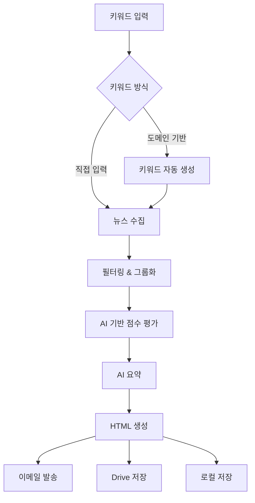

# Newsletter Generator 사용자 가이드

이 가이드는 Newsletter Generator의 모든 기능과 사용법을 상세히 설명합니다.

## 📋 목차

1. [기본 개념](#기본-개념)
2. [설치 및 설정](#설치-및-설정)
3. [기본 사용법](#기본-사용법)
4. [고급 기능](#고급-기능)
5. [템플릿 스타일](#템플릿-스타일)
6. [테스트 모드](#테스트-모드)
7. [문제 해결](#문제-해결)

## 기본 개념

Newsletter Generator는 다음과 같은 워크플로우로 동작합니다:



### 핵심 기능

- **🔍 다양한 뉴스 소스**: Serper API, RSS 피드, 네이버 뉴스 API
- **🎯 스마트 필터링**: 중복 제거, 주요 소스 우선순위, 키워드별 그룹화
- **⭐ AI 기반 점수 평가**: 관련성, 영향력, 참신성, 소스 신뢰도, 시간적 신선도를 종합한 우선순위 결정
- **🤖 AI 기반 요약**: Google Gemini Pro를 활용한 지능형 요약
- **📱 두 가지 스타일**: Compact(간결) / Detailed(상세)

## 설치 및 설정

자세한 설치 방법은 [설치 가이드](../setup/INSTALLATION.md)를 참조하세요.

### 빠른 설정

```bash
# 1. 저장소 클론
git clone https://github.com/username/newsletter-generator.git
cd newsletter-generator

# 2. 설치
pip install -e .

# 3. 환경 설정
cp .env.example .env
# .env 파일을 편집하여 API 키 설정
```

## 기본 사용법

### 1. 키워드 기반 뉴스레터 생성

가장 기본적인 사용법입니다:

```bash
# 기본 사용법
newsletter run --keywords "AI,머신러닝" --output-format html

# 이메일 발송 포함
newsletter run --keywords "자율주행,ADAS" --to user@example.com

# Google Drive 저장 포함
newsletter run --keywords "반도체,HBM" --drive --output-format html
```

### 2. 도메인 기반 자동 키워드 생성

특정 분야의 키워드를 자동으로 생성하여 뉴스레터를 만들 수 있습니다:

```bash
# 도메인 기반 키워드 자동 생성
newsletter run --domain "친환경 자동차" --output-format html

# 생성할 키워드 개수 지정
newsletter run --domain "배터리 기술" --suggest-count 5

# 모든 옵션 함께 사용
newsletter run --domain "인공지능" --suggest-count 7 --to user@example.com --drive
```

### 3. 키워드 추천 받기

먼저 키워드를 추천받고, 원하는 키워드를 선택하여 뉴스레터를 생성할 수 있습니다:

```bash
# 1단계: 키워드 추천
newsletter suggest --domain "자율주행" --count 10

# 2단계: 추천된 키워드로 뉴스레터 생성
newsletter run --keywords "추천된키워드1,추천된키워드2" --output-format html
```

## 고급 기능

### 필터링 옵션

뉴스 기사의 품질과 다양성을 제어할 수 있습니다:

```bash
# 도메인별 최대 기사 수 제한
newsletter run --keywords "AI반도체" --max-per-source 3

# 특정 필터링 기능 비활성화
newsletter run --keywords "메타버스,XR" --no-filter-duplicates --no-major-sources-filter

# 키워드별 그룹화 비활성화
newsletter run --keywords "블록체인" --no-group-by-keywords
```

### 수집 기간 설정

```bash
# 최근 7일간의 뉴스만 수집
newsletter run --keywords "AI" --period 7

# 최근 30일간의 뉴스 수집
newsletter run --keywords "자율주행" --period 30
```

### 기사 점수 평가 설정

AI가 기사의 우선순위를 결정하는 방식을 조정할 수 있습니다. `config.yml` 파일에서 다음 가중치를 설정할 수 있습니다:

```yaml
# config.yml
scoring:
  relevance: 0.40    # 관련성 (40%)
  impact: 0.25       # 영향력 (25%)
  novelty: 0.15      # 참신성 (15%)
  source_tier: 0.10  # 소스 신뢰도 (10%)
  recency: 0.10      # 시간적 신선도 (10%)
```

**점수 평가 기준:**
- **관련성**: 뉴스레터 주제/도메인과의 연관성
- **영향력**: 산업이나 사회에 미치는 영향의 크기
- **참신성**: 새로운 정보나 트렌드의 포함 정도
- **소스 신뢰도**: 뉴스 소스의 티어 (주요 언론사 우선)
- **시간적 신선도**: 기사 발행일 기준 최신성

### 비용 추적

LangSmith를 통해 AI 사용 비용을 추적할 수 있습니다:

```bash
# 비용 추적 활성화
newsletter run --keywords "AI" --track-cost --output-format html
```

### 로깅과 디버깅

애플리케이션은 구조화 로거를 사용하여 일관된 로그를 출력합니다. 모든 모듈은 `newsletter/utils/logger.py`의 `get_structured_logger`를 사용하며, 출력 수준은 `LOG_LEVEL` 환경 변수로 제어합니다.

```python
from newsletter.utils.logger import get_structured_logger as get_logger
logger = get_logger(__name__)
logger.info("작업 시작")
```

- LOG_LEVEL 기본값은 `INFO`입니다. 지원값: `DEBUG`, `INFO`, `WARNING`, `ERROR`, `CRITICAL`
- 예시: `LOG_LEVEL=DEBUG python -m newsletter run --keywords "AI,자동화"`

## 템플릿 스타일

Newsletter Generator는 두 가지 템플릿 스타일을 지원합니다:

### Compact 스타일 (간결)

- **목적**: 바쁜 임원진을 위한 빠른 개요
- **특징**:
  - 최대 10개 기사
  - 최대 3개 주제 그룹
  - 최대 3개 용어 정의
  - 간결한 요약

```bash
newsletter run --keywords "AI,머신러닝" --template-style compact
```

### Detailed 스타일 (상세) - 기본값

- **목적**: 연구원을 위한 종합적 분석
- **특징**:
  - 모든 필터된 기사 포함
  - 최대 6개 주제 그룹
  - 그룹별 0-2개 용어 정의 (중복 없음)
  - 상세한 문단 요약

```bash
newsletter run --keywords "AI,머신러닝" --template-style detailed
# 또는 (기본값이므로 생략 가능)
newsletter run --keywords "AI,머신러닝"
```

### Email-Compatible 템플릿

모든 이메일 클라이언트(Gmail, Outlook, Apple Mail 등)에서 완벽하게 렌더링되도록 최적화된 템플릿입니다.

**특징**:
- **테이블 기반 레이아웃**: Flexbox/Grid 대신 안정적인 테이블 구조 사용
- **인라인 CSS**: 모든 스타일이 인라인으로 처리되어 이메일 클라이언트 제약 회피
- **호환성 우선**: CSS 변수, 고급 CSS 속성 미사용
- **모바일 반응형**: 모든 디바이스에서 최적화된 렌더링
- **한글 폰트 지원**: 시스템 폰트 기반 안정적인 한글 표시

```bash
# Detailed + Email-Compatible
newsletter run --keywords "AI,머신러닝" --template-style detailed --email-compatible

# Compact + Email-Compatible
newsletter run --keywords "AI,머신러닝" --template-style compact --email-compatible

# Email-Compatible + 바로 전송
newsletter run --keywords "AI,머신러닝" --email-compatible --to user@example.com
```

**이메일 클라이언트 호환성**:
| 클라이언트 | 일반 템플릿 | Email-Compatible |
|------------|-------------|------------------|
| Gmail (웹) | ⚠️ 부분 지원 | ✅ 완전 지원 |
| Outlook (웹/데스크톱) | ❌ 레이아웃 깨짐 | ✅ 완전 지원 |
| Apple Mail | ✅ 대부분 지원 | ✅ 완전 지원 |
| 모바일 앱들 | ⚠️ 부분 지원 | ✅ 완전 지원 |
| 회사 웹메일 | ❌ 지원 제한 | ✅ 완전 지원 |

**사용 권장 사항**:
- 🎯 **이메일 전송이 목적**인 경우: `--email-compatible` 필수
- 🌐 **웹에서만 보기**인 경우: 일반 템플릿으로도 충분
- 📱 **모바일 최적화**가 중요한 경우: `--email-compatible` 권장

## 테스트 모드

기존 데이터를 활용하여 다양한 테스트를 수행할 수 있습니다:

### Template 모드

기존 뉴스레터 데이터를 현재 HTML 템플릿으로 재렌더링합니다:

```bash
# 기본 Template 모드
newsletter test output/render_data_20250522_143255.json --mode template

# 커스텀 출력 파일 지정
newsletter test output/render_data_20250522_143255.json --mode template --output custom.html
```

### Content 모드

이전에 수집된 기사 데이터로 전체 프로세스를 재실행합니다:

```bash
# Content 모드 (수집 단계 제외)
newsletter test output/collected_articles_AI.json --mode content

# 비용 추적과 함께
newsletter test output/collected_articles_AI.json --mode content --track-cost
```

### 이메일 테스트 모드

Newsletter Generator는 뉴스레터 생성 없이 이메일 발송 기능만 단독으로 테스트할 수 있는 기능을 제공합니다.

### 기본 이메일 테스트

간단한 테스트 메시지를 발송하여 Postmark 설정을 확인할 수 있습니다:

```bash
# Dry run 모드 (실제 발송 없음)
newsletter test-email --to your-email@example.com --dry-run

# 실제 테스트 이메일 발송
newsletter test-email --to your-email@example.com
```

### 기존 뉴스레터 파일로 테스트

이미 생성된 HTML 뉴스레터 파일을 사용하여 이메일 발송을 테스트할 수 있습니다:

```bash
# 특정 HTML 파일로 테스트
newsletter test-email --to your-email@example.com --template output/newsletter.html --dry-run

# 커스텀 제목으로 실제 발송
newsletter test-email --to your-email@example.com --template output/newsletter.html --subject "뉴스레터 테스트"
```

### 통합 테스트 스크립트

더 상세한 테스트를 위해 전용 통합 테스트 스크립트를 사용할 수 있습니다:

```bash
# 기본 통합 테스트 (dry-run)
python tests/test_email_integration.py --to your-email@example.com

# 실제 이메일 발송 테스트
python tests/test_email_integration.py --to your-email@example.com --send-real

# 특정 뉴스레터 파일로 테스트
python tests/test_email_integration.py --to your-email@example.com --newsletter-file output/specific_newsletter.html
```

통합 테스트 스크립트는 다음 기능을 제공합니다:

- 📧 **설정 검증**: Postmark 토큰과 발송자 이메일 설정 확인
- 📁 **파일 검색**: 사용 가능한 뉴스레터 HTML 파일 자동 검색
- 📤 **기본 테스트**: 간단한 테스트 이메일 발송
- 📰 **뉴스레터 테스트**: 실제 뉴스레터 파일을 사용한 이메일 발송
- 🎯 **결과 요약**: 테스트 결과와 다음 단계 안내

### 이메일 테스트 옵션

| 옵션 | 설명 | 예시 |
|------|------|------|
| `--to` | 수신자 이메일 주소 (필수) | `--to user@example.com` |
| `--subject` | 커스텀 이메일 제목 | `--subject "테스트 이메일"` |
| `--template` | 사용할 HTML 파일 경로 | `--template output/newsletter.html` |
| `--dry-run` | 실제 발송 없이 설정만 확인 | `--dry-run` |

### 문제 해결

이메일 테스트 중 문제가 발생하면 다음을 확인하세요:

1. **Postmark 설정 확인**:
   ```bash
   # 설정 상태 확인
   newsletter test-email --to test@example.com --dry-run
   ```

2. **환경 변수 확인**:
   - `POSTMARK_SERVER_TOKEN`: Postmark 서버 토큰
   - `EMAIL_SENDER`: 발송자 이메일 주소 (Postmark에서 인증 필요)

3. **Postmark 계정 상태**:
   - 계정이 승인되었는지 확인
   - 발송자 도메인이 인증되었는지 확인
   - 계정 승인 대기 중인 경우 같은 도메인 내에서만 테스트 가능
   - 수신자가 비활성화(inactive)된 경우: 하드 바운스, 스팸 신고, 수동 차단된 이메일 주소
   - 오류 422 발생 시 다른 이메일 주소로 테스트 필요

## 출력 형식

### 로컬 저장

```bash
# HTML 형식 (기본값)
newsletter run --keywords "AI" --output-format html

# Markdown 형식
newsletter run --keywords "AI" --output-format md
```

### 이메일 발송

```bash
# 단일 수신자
newsletter run --keywords "AI" --to user@example.com

# 여러 수신자 (환경 변수로 설정)
# .env 파일에 EMAIL_RECIPIENTS=user1@example.com,user2@example.com
newsletter run --keywords "AI" --to-multiple
```

### Google Drive 저장

```bash
# Drive에만 저장
newsletter run --keywords "AI" --drive

# 로컬과 Drive 모두 저장
newsletter run --keywords "AI" --drive --output-format html
```

## 문제 해결

### 일반적인 문제

#### 1. API 키 오류

```bash
# 환경 변수 확인
echo $GEMINI_API_KEY
echo $SERPER_API_KEY

# .env 파일 확인
cat .env
```

#### 2. 뉴스 수집 실패

```bash
# 네트워크 연결 확인
ping google.com

# API 상태 확인
curl -H "X-API-Key: YOUR_SERPER_KEY" https://google.serper.dev/search
```

#### 3. 메모리 부족

```bash
# 기사 수 제한
newsletter run --keywords "AI" --max-per-source 5

# 수집 기간 단축
newsletter run --keywords "AI" --period 7
```

### 디버깅 모드

```bash
# 상세한 로그 출력
PYTHONPATH=. python -m newsletter.cli run --keywords "AI" --verbose

# 중간 결과 저장
newsletter run --keywords "AI" --save-intermediate
```

### 로그 확인

```bash
# 로그 파일 위치
ls -la output/logs/

# 최근 로그 확인
tail -f output/logs/newsletter_$(date +%Y%m%d).log
```

## 성능 최적화

### 빠른 실행을 위한 팁

```bash
# 최소한의 기사만 수집
newsletter run --keywords "AI" --max-per-source 3 --period 3

# 필터링 최소화
newsletter run --keywords "AI" --no-filter-duplicates --no-major-sources-filter

# Compact 스타일 사용
newsletter run --keywords "AI" --template-style compact
```

### 배치 처리

```bash
# 여러 키워드 세트를 순차 처리
for keywords in "AI,머신러닝" "자율주행,ADAS" "반도체,HBM"; do
    newsletter run --keywords "$keywords" --output-format html
done
```

## 다음 단계

- [CLI 참조](CLI_REFERENCE.md) - 모든 명령어와 옵션의 상세 설명
- [예시 모음](EXAMPLES.md) - 다양한 사용 시나리오와 예시
- [FAQ](FAQ.md) - 자주 묻는 질문과 답변
- [개발자 가이드](../dev/DEVELOPMENT_GUIDE.md) - 커스터마이징 및 확장 방법
